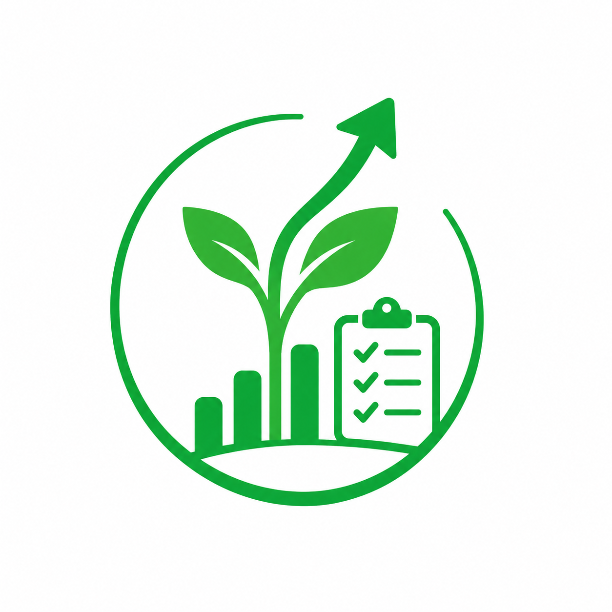

  

<h1 align="center">Up Field</h1>
<h3 align="center">Enterprise Route Management & Customer Portal</h3>

---

> **⚠️ CONFIDENTIAL & PROPRIETARY**
> 
> This repository and its entire contents (including all source code, design assets, and documentation) are the strictly private and proprietary property of **Goorac Corporation**. 
> 
> Unauthorized access, copying, modification, distribution, or public display of this software is strictly prohibited. This codebase is intended for internal enterprise use only.

---

## 📌 System Overview

**Up Field** is a high-performance, dual-interface platform engineered for seamless field agent routing and transparent customer ledger management. The system balances a zero-read local caching strategy for GPS navigation with highly secure, live database reads for financial transactions.

### Core Components

#### 1. The Agent Application (`/admin`)
*   **Dynamic Queue Engine:** Live GPS tracking utilizing the Haversine formula to constantly re-sort the agent's route (Stop #1, Stop #2) without burning database reads.
*   **Enterprise UI/UX:** Features a custom Dark Mode Google Maps engine, native haptic feedback (vibrations), and a fluid, swipeable bottom sheet with a Pre-Flight Hold loading architecture.
*   **Financial Decoupling:** The mapping interface (`home.html`) handles pure routing, safely handing off to the secure entry interface (`entry.html`) for live financial ledger updates.

#### 2. The Customer Portal (Root)
*   **Client-Facing Dashboard:** A standalone, responsive web app (`index.html`) allowing customers to securely view their active products via ID lookup.
*   **Live Ledger Timeline:** Features dynamic progress bars, exact outstanding balances, and color-coded status badges (Processing, Paid, Failed) for complete payment transparency.
*   **Native Theming:** Automatically adapts to the customer's device settings (Light/Dark mode) for a seamless, downloaded-app experience.

---

  &copy; 2026 <b>Goorac Corporation</b>. All Rights Reserved.

